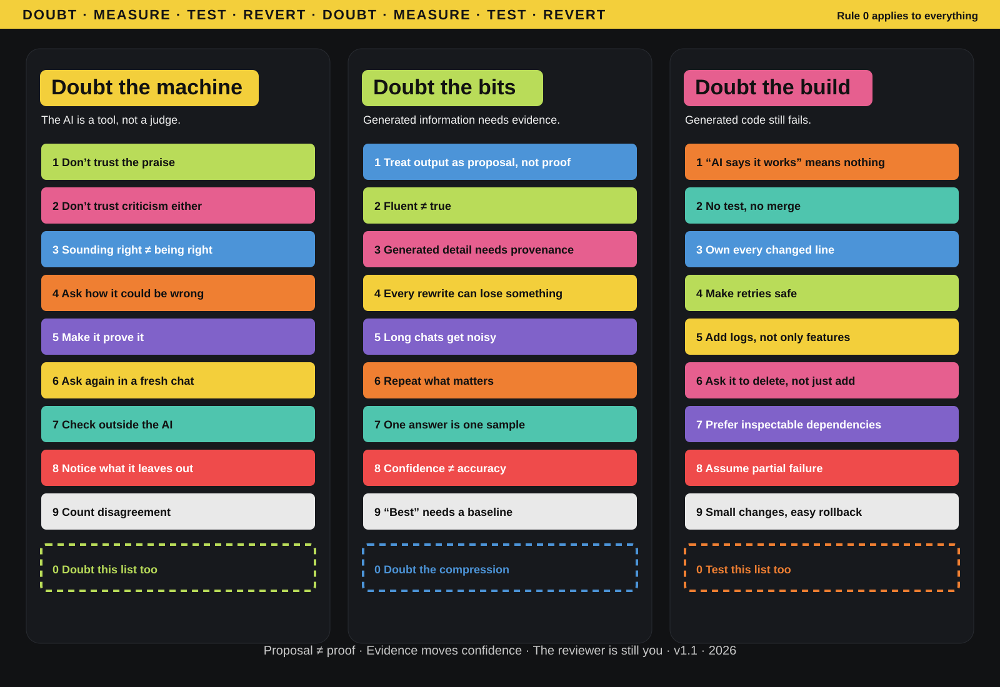

# Doubt the Machine

**A five-minute operating manual for using AI without confusing fluency with evidence.**

> **Rule 0:** apply this framework to itself. Doubt it, measure it, test it, and revert it when it fails.

**Scope:** use this when AI output crosses the boundary from proposal into **belief, decision, execution, or persistence**. Creative play and low-stakes ideation need little ceremony; verification should rise with the cost and reversibility of being wrong.



```text
DOUBT → MEASURE → TEST → REVERT → REPEAT
```

AI can generate plausible answers, code, summaries, and plans much faster than we can verify them. That creates the core failure mode this project addresses:

> **confidence can move faster than evidence.**

Doubt the Machine is not an argument for using AI less. It is a small discipline for using it **more aggressively without outsourcing judgment**.

There are three surfaces:

| Surface | Focus | Default question |
|---|---|---|
| **Doubt the machine** | Interaction and authority | Who or what am I letting judge the claim? |
| **Doubt the bits** | Information and uncertainty | What is sourced, inferred, missing, or merely fluent? |
| **Doubt the build** | Execution and operations | What observed behavior proves this survives reality? |

The poster is compressed for memory. **This README is the canonical five-minute version.** The rationale underneath it lives in [PRINCIPLES.md](PRINCIPLES.md).

## Use it in 60 seconds

Before accepting an AI-assisted claim or change:

```text
1. CLAIM      What exactly am I being asked to believe or merge?
2. FAILURE    What is one plausible way it could be wrong?
3. EVIDENCE   What evidence is meaningfully independent of the model?
4. TEST       What is the cheapest test that could falsify it?
5. REVERSAL   If I am wrong, can I undo the decision cheaply?
```

Then **accept, revise, test again, or revert**.

Verification effort should scale with the cost of being wrong. Brainstorming needs little ceremony. Production, security, medical, financial, or irreversible decisions need much more.

## Match the evidence to the claim

| Claim | Better evidence |
|---|---|
| Current fact | Primary or live source; check date and scope |
| Number | Recompute; inspect units and assumptions |
| Code behavior | Reproducible run, tests, edge cases, logs, CI |
| “Best”, “faster”, “SOTA” | Baseline, metric, dataset, environment, uncertainty |
| Summary | Compare with source; inspect omissions and changed qualifiers |
| Design recommendation | Alternatives, constraints, trade-offs, failure modes |
| High-stakes decision | Primary evidence plus qualified human review where appropriate |

The key word is **independent**. A model critiquing its own answer can reveal inconsistencies; it is not the same as an external check.

## 1 — Doubt the machine

**The AI is a tool, not a judge.** Social signals are not evidence.

| # | Rule | Operational meaning |
|---|---|---|
| 1 | **Don’t trust the praise** | Approval does not make a claim true. |
| 2 | **Don’t trust the criticism either** | Push back. Good criticism should survive a counterargument. |
| 3 | **Sounding right is not being right** | Fluency is presentation, not verification. |
| 4 | **Ask how it could be wrong** | Request failure modes, assumptions, and counterexamples. |
| 5 | **Make it prove it** | Ask for a source, derivation, test, or falsifier. |
| 6 | **Ask again in fresh context** | Expose anchoring; remember this is another sample, not guaranteed independence. |
| 7 | **Check outside the AI** | Use primary sources, tests, benchmarks, data, or relevant expertise. |
| 8 | **Notice what it leaves out** | Missing alternatives and qualifiers can matter more than polished prose. |
| 9 | **Test framing invariance** | Ask under supportive, opposing, and neutral framing. Disagreement itself is not evidence. |

**Reflexive check:** apply Rule 0 to this panel too.

## 2 — Doubt the bits

**Generated information is not self-authenticating.** Separate source, inference, hypothesis, and unknown.

| # | Rule | Operational meaning |
|---|---|---|
| 1 | **Treat output as a proposal, not proof** | Generated text does not certify itself. |
| 2 | **Fluent does not mean true** | Readability can increase trust without increasing accuracy. |
| 3 | **Generated detail needs provenance** | New reasoning is possible; unsupported specifics still need evidence. |
| 4 | **Every rewrite can lose something** | Check dropped conditions, exceptions, and uncertainty. |
| 5 | **Long chats get noisy** | Old assumptions and errors can bias later answers. Re-state the task when needed. |
| 6 | **Repeat what matters** | Restate critical constraints, invariants, and definitions. |
| 7 | **One answer is one sample** | Re-sample when variance matters; compare methods, not only wording. |
| 8 | **Confident tone is not accuracy** | Separate style from evidence. |
| 9 | **“Best” needs a baseline** | No superlative without comparator, metric, data, and conditions. |

**Reflexive check:** compression can hide the failure mode, so apply Rule 0 here too.

## 3 — Doubt the build

**Generated code still has to survive reality.** Trust observed behavior, not the explanation around it.

| # | Rule | Operational meaning |
|---|---|---|
| 1 | **“The AI says it works” means nothing** | Run it in the real environment or a faithful reproduction. |
| 2 | **No unverified behavior, no merge** | Match evidence to the claim: tests for behavior; inspection, derivation, or provenance for non-runtime changes. |
| 3 | **Own every changed behavior** | Verify invariants and risk-bearing paths; sample low-risk generated surfaces when line-by-line review does not scale. |
| 4 | **Make retries safe** | Prefer idempotency, explicit state, bounded retries, and recovery. |
| 5 | **Add logs, not only features** | Instrument failure so reality can disagree visibly. |
| 6 | **Ask it to delete, not just add** | Remove dead paths, duplicate abstractions, and speculative complexity. |
| 7 | **Prefer inspectable dependencies** | Familiar, documented tools are easier to verify; novelty needs stronger checking. |
| 8 | **Assume partial failure** | Network, storage, permissions, data, dependencies, and users fail independently. |
| 9 | **Small changes, easy rollback** | Keep blast radius low and reversal cheap. |

**Reflexive check:** process rules are hypotheses, not commandments.

For code, the compact gate is:

```text
reproduce → match evidence → inspect risk → exercise failure → observe → rollback-plan → merge
```

## Rule 0 is the important one

Without Rule 0, a checklist against blind trust can become another object of blind trust.

So:

- challenge every rule;
- prefer counterexamples over agreement;
- tighten wording when it overclaims;
- keep changes small and reversible;
- protect no rule from deletion.

The target is a framework that **gets harder to fool as people try to break it**.

Rule 0 now has visible artifacts rather than only a slogan:

- [FALSIFIERS.md](FALSIFIERS.md) states what would weaken or kill the framework’s claims.
- [GRAVEYARD.md](GRAVEYARD.md) preserves rules and formulations that were retired.
- [EVIDENCE.md](EVIDENCE.md) maps important rules to prior work and external evidence.
- [Experiment 001](experiments/001-seeded-errors/README.md) preregisters the first controlled self-test.

**Current status:** the framework’s net effectiveness is still a **hypothesis**, not a measured result. Experiment 001 is designed to change that status or kill the claim.

## Development cadence

Use a simple tick/tock rhythm for changes to this repository:

```text
DOUBT → MEASURE → TEST → REVERT → REPEAT
```

| Cycle | Change axis | Required discipline |
|---|---|---|
| **Tick** | Rule content | Add, tighten, weaken, or retire a rule, and update every surface that quotes it: README, poster, retired ledger, graveyard, falsifiers, and checks where needed. |
| **Tock** | Verification | Run an experiment, extend checker coverage, audit citations, or update evidence and results without rewording active rules. |

Set the verification effort before inspecting outcomes:

| Effort | Use when | Required checks |
|---|---|---|
| **Light** | Wording, links, or presentation only | Run the Rule 0 checker and inspect every touched surface. |
| **Standard** | Active rules, retired-rule coverage, falsifiers, evidence ledgers, or CI checks | Run the checker, verify affected claims against their sources, and keep the rollback path explicit. |
| **High** | Experiments, metrics, kill conditions, external claims, or anything that could rescue a failed result | Preregister the claim and failure mode, preserve controls, require independent review, and treat insufficient precision as inconclusive. |

Each PR should move one major axis at a time. If a change needs both new wording and new measurement, split it. That keeps regressions attributable, hardening honest, and rollback cheap.

## What this is — and is not

This is a compact **verification and reversibility discipline** for human–AI work.

It does not assume humans are reliable by default. Humans also anchor, omit, overclaim, and rationalize. The useful asymmetry is speed: AI can produce plausible material faster than a human can carefully verify it.

The braking mechanism is intentionally boring:

**doubt the claim → measure what matters → test the failure mode → revert cheaply when reality disagrees.**

It is also possible to doubt badly. Verification theatre, performative disagreement, and doubt paralysis are failure modes of this framework itself; see [PRINCIPLES.md](PRINCIPLES.md).

## Contributing

Found a counterexample or overclaim? Good. See [CONTRIBUTING.md](CONTRIBUTING.md) and challenge it with evidence. The deeper assumptions are in [PRINCIPLES.md](PRINCIPLES.md).

## License

Text and original visual framework: [CC BY 4.0](LICENSE.md). Reuse, remix, and improve it with attribution.

---

**Rule 0:** this README was assembled with AI assistance. Doubt it too.
